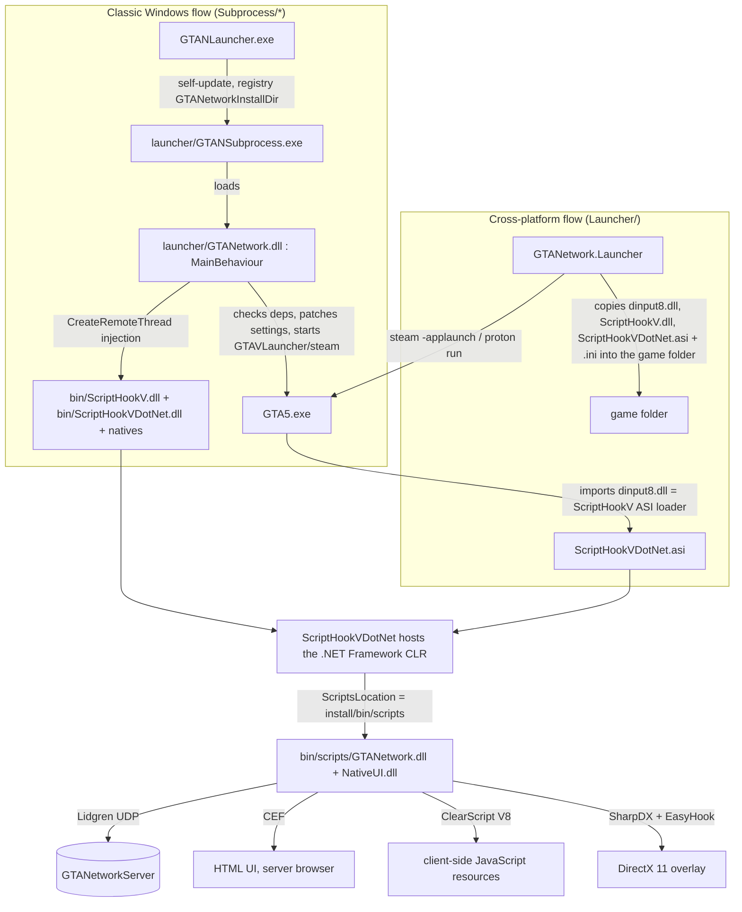

# GTA Network (revived)

[](https://github.com/SashaGoncharov19/FreeMode/actions/workflows/build.yml)

GTA Network (GTA:N) is a multiplayer modification for Grand Theft Auto V: a dedicated server with a
scripting API (C#, VB, JavaScript on the client) and an in-game client that synchronises players,
vehicles, weapons and the world between everybody connected to a server.

This repository is the revived code base. Compared with the original (Visual Studio 2017, .NET Framework,
Windows only) it now has:

* **one `dotnet build` for everything** - SDK-style projects, NuGet package references, a single `GTANetwork.sln`;
* **a server that runs natively on Linux** (and Windows/macOS) on .NET 8 - scripts are compiled with Roslyn,
  Unix signals stop it cleanly, the HTTP file server no longer needs Nancy/OWIN;
* **a cross-platform launcher** (`GTANetwork.Launcher`) that starts the game through Steam/Proton on Linux
  using the standard ScriptHookV ASI loader instead of DLL injection;
* **GitHub Actions** that build, smoke-test and package everything (Linux job + Windows job for the C++/CLI part);
* the in-game client can be *compiled* on any OS thanks to a managed reference stub of ScriptHookVDotNet.

> Honest status: the build system, the server (Linux) and the launcher logic are verified by tests.
> The in-game part (ScriptHookV / ScriptHookVDotNet hooks, memory patterns, natives) is unchanged since the
> original 2019-2020 code and could not be tested against the current GTA V build here. See
> [Known limitations](#known-limitations).

Ukrainian version: [README.uk.md](README.uk.md).

---

## Repository layout

| Path | Project | Target | What it is |
| --- | --- | --- | --- |
| `Shared/` | `GTANetworkShared` | net48 + netstandard2.0 | Packets, entity properties, math, settings, protobuf contracts shared by client and server. |
| `Server/` | `GTANetworkServer` | **net8.0** | Dedicated server: Lidgren UDP networking, streamer, resources, scripting API (`API.cs`), HTTP file server. Runs on Linux. |
| `Launcher/` | `GTANetwork.Launcher` | **net8.0** | Cross-platform launcher (Steam / Proton / Windows). |
| `Client/` | `GTANetwork` (client) | net48 | The in-game client, loaded inside `GTA5.exe` by ScriptHookVDotNet. Sync, streaming, CEF UI, JS engine, DirectX hook. |
| `NativeUI/` | `NativeUI` | net48 | Rockstar-style menu library used by the client (GPL-3.0). |
| `Shv.NET/` | `ScriptHookVDotNet` | C++/CLI, net48 | GTA Network's fork of crosire's ScriptHookVDotNet v3. **Windows + MSVC only**, needs the ScriptHookV SDK. |
| `Shv.NET/ref/` | `ScriptHookVDotNet.Ref` | net48 | Managed *reference stub* with the same API surface, so the client compiles on Linux. Never shipped. |
| `Subprocess/` | `GTANLauncher`, `GTANSubprocess`, launcher `GTANetwork.dll` | net48 | The classic three-stage Windows launcher (registry, updates, DLL injection). Still builds, still works on Windows. |
| `Map2Resource/` | `Map2Resource` | net8.0 | Converts Map Editor XML files into server map resources. |
| `Tools/GTANetwork.Bot/` | `GTANetwork.Bot` | **net8.0** | Headless client that speaks the real protocol: joins a server, downloads map and scripts, chats, runs commands. Used by the CI integration test. |
| `libs/` | - | - | Binary dependencies without a NuGet equivalent: the custom Lidgren fork, CEF 3.2987 (Chromium 57, 2017) + CefGlue, SharpDX mix, NAudio, native V8/EasyHook DLLs. |
| `images/` | - | - | HUD, map and CEF assets shipped with the client. |
| `Setup/` | - | NSIS | Windows installer script. |
| `eng/` | - | scripts | Version computation, server smoke test, client packaging. |
| `.github/workflows/` | - | CI | The build pipeline. |

## How it works

### Client side (what happens when you press "Play")



1. **ScriptHookV** (Alexander Blade, closed source, not redistributable) provides the native script hook;
   its `dinput8.dll` loads every `*.asi` from the game folder.
2. **ScriptHookVDotNet** (`Shv.NET/`, C++/CLI) hosts the .NET Framework runtime inside `GTA5.exe`, exposes the
   `GTA.*` API and loads only `GTANetwork.dll` and `NativeUI.dll` from its `ScriptsLocation`
   (`ScriptHookVDotNet.ini`, default `scripts` next to the DLL).
3. **`GTANetwork.dll`** (`Client/`) is a `GTA.Script`. `Main.cs` sets up the menu (server browser, quick
   connect), connects with Lidgren, and the `Sync/`, `Streamer/`, `Javascript/`, `GUI/` folders implement
   entity sync, streaming, the JS engine (ClearScript V8) and the CEF browser overlay drawn through a DirectX 11
   swap-chain hook.
4. The client finds its installation folder (`bin/`, `cef/`, `images/`, `settings.xml`, `logs/`) through the
   registry value the classic launcher writes, or - new - the `GTAN_INSTALL_DIR` environment variable, or by
   walking up from its own location (`<install>/bin/scripts/GTANetwork.dll`). The last two make Proton work.

### Server side

```
server/
  GTANetworkServer(.exe)     .NET 8 app (dotnet GTANetworkServer.dll also works)
  settings.xml               name, port (UDP 4499), max players, which resources to start, httpserver ...
  vehicleData.json           vehicle metadata used by the streamer
  resources/<name>/meta.xml  one folder per resource
```

* `Program.cs` reads `settings.xml`, creates `GameServer` and ticks it 60 times per second.
* `GameServer` (`GameServer.cs`, `ProcessMessages.cs`, `Packets.cs`) owns the Lidgren `NetServer`: connection
  approval, version checks, sync packets, the entity streamer (`Managers/Streamer.cs`), pickups, colshapes.
* `Resources.cs` starts resources listed in `settings.xml`. A resource's `meta.xml` declares:
  * `<script src="x.cs" type="server" lang="csharp|vbasic|compiled"/>` - server scripts, compiled **at
    runtime with Roslyn** (`Managers/ScriptCompiler.cs`) or loaded as a prebuilt DLL; every public class
    deriving from `GTANetworkServer.Script` is instantiated and gets an `API` instance (`API.cs`, ~170 KB of
    server API: events, entities, chat, players, ...).
  * `<script src="x.js" type="client" lang="javascript"/>` - client scripts, hashed and streamed to players
    over UDP or served by the HTTP file server (`Managers/FileServer.cs`, `GET /manifest.json`,
    `GET /<resource>/<path>`).
  * `<file src="..."/>` client files, `<map src="..."/>` map XML, `<include resource="..."/>` dependencies,
    `<export function="..."/>` cross-resource calls, `<assembly ref="..."/>` extra references.
* `Server/resources/example` is a minimal C# gamemode that is started by the default `settings.xml`.

## Building

Prerequisites:

* [.NET 8 SDK](https://dotnet.microsoft.com/download) on any OS - builds **everything managed**, including
  the .NET Framework client (through `Microsoft.NETFramework.ReferenceAssemblies`).
* Windows + Visual Studio 2022 with *C++/CLI support* and the *Windows 10/11 SDK* - only for the real
  `ScriptHookVDotNet.dll`. Put the [ScriptHookV SDK](http://www.dev-c.com/gtav/scripthookv/) (`inc/`, `lib/`)
  into `Shv.NET/sdk/`, or run `Shv.NET/sdk-compat/install-compat-sdk.ps1` from a Developer PowerShell: it
  installs equivalent declarations and generates the import library (dev-c.com blocks automated downloads,
  so this is what CI uses unless the repository variable `SHV_SDK_URL` points to a copy of the SDK).

```bash
# everything (on Linux/macOS the client is compiled against the reference stub)
dotnet build GTANetwork.sln -c Release

# server, ready to run on Linux
dotnet publish Server/GTANetworkServer.csproj -c Release -r linux-x64 --self-contained false -o out/server

# cross-platform launcher as a single file
dotnet publish Launcher/GTANetwork.Launcher.csproj -c Release -r linux-x64 --self-contained false -p:PublishSingleFile=true -o out/launcher

# Windows only: the C++/CLI hook (then rebuild the solution: it is picked up automatically)
msbuild Shv.NET/ScriptHookVDotNet.sln /p:Configuration=Release /p:Platform=x64
```

When `Shv.NET/bin/ScriptHookVDotNet.dll` exists, `Client` and `NativeUI` link against it; otherwise they use
`Shv.NET/ref` (`UseRealShvdn` property). Only binaries built against the real DLL may be shipped.

Version numbers keep the original scheme `0.1.<days since 2016-01-01>.<UTC minutes / 2>` (the protocol
compares them), computed in `Directory.Build.props`; CI passes the commit date via `eng/version.sh`.

## Running a server on Linux

```bash
dotnet publish Server/GTANetworkServer.csproj -c Release -r linux-x64 --self-contained false -o ~/gtan-server
cp vehicleData.json ~/gtan-server/
cd ~/gtan-server && ./GTANetworkServer
```

Edit `settings.xml` (server name, `serverport`, `maxplayers`, `password`, `<resource src="..."/>`).
Open **UDP 4499** (and **TCP 4499** if `<httpserver>true</httpserver>`). `Ctrl+C`, `SIGTERM` (systemd,
Docker) and `SIGHUP` stop it cleanly. The public master server (`master.gtanet.work`) no longer exists, so
`<announce>` is off and players connect by IP.

`eng/smoke-test-server.sh <dir>` starts a published server, checks that the example resource compiles and
runs, that `/manifest.json` answers and that the process exits on `SIGTERM`; CI runs it on every push.

### Trying a server without the game: the headless bot

`GTANetwork.Bot` is a console client that implements the client side of the protocol (Lidgren UDP,
protobuf packets from `GTANetworkShared`): discovery, the `ConnectionRequest` handshake, map and
client-script download, `ConnectionConfirmed`, chat and commands, position sync, and it prints every
packet the server pushes (entity creation, native calls, events) in readable form.

```bash
dotnet run --project Tools/GTANetwork.Bot -- --host 127.0.0.1 --port 4499 --name Tester --discover \
  --say "/help" --say "/veh adder" --say "/pos" --say "hello" --duration 5
```

With `--interactive` the bot keeps reading chat lines and `/commands` from stdin until `/quit`, so you can
drive a server from a terminal.

`eng/integration-test.sh <server dir> <bot>` starts a server with the bundled `freeroam` gamemode, joins it
with the bot, runs a handful of commands and asserts the replies, then connects two bots at once and checks
that chat, vehicle creation and position sync are relayed between them; CI runs it on every push. The bot is
also a good way to see what a gamemode does over the wire while developing server scripts on Linux.

## Playing on Linux (Proton)

Only **GTA V Legacy** (Steam app 271590) is supported; the Enhanced edition has a different executable.

### Quick start (one script)

```bash
# 0. tools (protontricks is installed by the script itself when needed)
sudo apt install curl unzip python3
# 1. run GTA V once through Steam (creates the Proton prefix)
# 2. download the ScriptHookV zip from http://www.dev-c.com/gtav/scripthookv/ with a browser (it blocks scripts)
# 3. install everything into ~/GTANetwork from the latest GitHub release:
curl -fsSL https://raw.githubusercontent.com/SashaGoncharov19/FreeMode/master/eng/setup-linux.sh | bash -s -- --name YourNick
```

`eng/setup-linux.sh` downloads the client package, the self-contained Linux launcher, server and bot (no .NET
to install), copies `ScriptHookV.dll` + `dinput8.dll` out of the newest `~/Downloads/ScriptHookV*.zip` (or
`--shv <zip>`), writes `settings.xml` (launch method `proton`, your name, `127.0.0.1:4499` in the favourites),
installs `protontricks` when it is missing (Debian keeps it in `contrib`: the script enables that component for
the official repositories, backups are kept; otherwise a python venv + winetricks from GitHub, or Flatpak),
puts .NET Framework 4.8 + the VC++ runtime into the game's prefix, creates `play.sh`, `server/start.sh`,
`bot.sh`, `update.sh` and a desktop entry, and keeps a copy of itself plus your options in `~/GTANetwork`.
`--build` compiles launcher/server/bot from a git checkout instead of downloading them (the client package
still comes from a release because ScriptHookVDotNet needs MSVC), `--release <tag>` pins a version,
`--game-path` helps when Steam auto-detection fails, `--method steam` if you prefer Steam launch options.

Client settings live in `~/GTANetwork/settings.xml`: `MasterServerAddress` is empty by default (the original
master server is gone; favourites, recent servers and LAN discovery work without one), `EnableMpVehiclesGlobal`
stays off because its script-global index is from 2016 builds.

Then: `~/GTANetwork/server/start.sh` in one terminal, `~/GTANetwork/play.sh` in another, and in the game
menu pick `127.0.0.1:4499` from Favorites. `~/GTANetwork/bot.sh` joins the server without the game.

**Updates.** `play.sh`, `server/start.sh` and `bot.sh` first run `update.sh --quiet`, which asks GitHub for the
newest release and installs it when it differs from the installed one (`~/GTANetwork/release.txt`); the setup
script updates itself from the release as well. Your `settings.xml`, ScriptHookV and `server/settings.xml` are
kept, and nothing is touched while a server, bot or launcher from that folder is running. `update.sh --check`
only reports, `update.sh --auto-update off` switches the automatic check off (`GTAN_NO_UPDATE=1` skips it once),
`update.sh --release <tag>` pins a version, `update.sh --shv <zip>` installs a new ScriptHookV.

### Manual steps

1. Install and run the game once through Steam so that Proton creates its prefix.
2. Install the .NET Framework into that prefix (ScriptHookVDotNet needs it):
   `protontricks 271590 dotnet48` (or `WINEPREFIX=~/.steam/steam/steamapps/compatdata/271590/pfx winetricks dotnet48`).
   The .NET 4.0 installer fails with `Failed to extract cabinet: netfx_core.mzz` on very new wine builds (Proton
   Experimental): install Proton 8.0 in Steam and run `PROTON_VERSION="Proton 8.0" protontricks 271590 dotnet48`;
   the game itself can keep using any Proton. `setup-linux.sh` does this by itself and, when no stable Proton is
   installed, downloads GE-Proton8-32 into Steam's `compatibilitytools.d`. Afterwards run `protontricks 271590 win10`:
   winetricks leaves the prefix at Windows 7 and the Rockstar Launcher wants Windows 10 (the script does that too).
   The original client also required the Visual C++ 2013/2015 runtimes (`vcrun2013`, `vcrun2015`).
3. Unpack the client package (`gtanetwork-client-win64-*.zip` from the Actions artifacts / a release)
   somewhere, e.g. `~/GTANetwork`, and copy the Linux launcher (`gtanetwork-launcher-linux-x64-*`) into it.
4. Download ScriptHookV from <http://www.dev-c.com/gtav/scripthookv/> and copy `ScriptHookV.dll` and
   `dinput8.dll` into `~/GTANetwork/bin/`.
5. In Steam set the launch options of GTA V to `WINEDLLOVERRIDES="dinput8=n,b" %command%` (this makes Wine
   use ScriptHookV's `dinput8.dll` instead of its built-in one).
6. `~/GTANetwork/GTANetwork.Launcher doctor` shows what was detected (Steam, library, game folder, prefix,
   Proton) and what is missing. Fix the warnings.
7. `~/GTANetwork/GTANetwork.Launcher` deploys the mod into the game folder, starts the game through Steam,
   waits until `GTA5.exe` exits and restores the folder (other `*.asi` plugins are parked in `Disabled/`
   for the session). `--method proton` starts Proton directly instead of asking Steam; `--no-wait`,
   `--keep-asi`, `--game-path`, `--prefix`, `--proton`, `--save` are documented in `--help`.

Everything the launcher touches is recorded in `gtanetwork-deploy.json` inside the game folder and undone by
`GTANetwork.Launcher restore` (also automatically on the next start after a crash).

## Playing on Windows

* Classic: run `GTANSetup-<version>.exe` (NSIS installer) or unpack the client zip and start
  `GTANLauncher.exe` as administrator (it writes the install folder to the registry and injects the hook).
* New: `GTANetwork.Launcher.exe` from the same folder uses the ASI-loader flow described above
  (`--method direct` starts `PlayGTAV.exe`, `--method steam` uses the Steam protocol).

Both need `ScriptHookV.dll` + `dinput8.dll` in `bin\` and the .NET Framework 4.8.

## Continuous integration

`.github/workflows/build.yml` runs on every push, pull request and tag:

| Job | Runner | Does |
| --- | --- | --- |
| **linux** | ubuntu-latest | `dotnet build GTANetwork.sln` (client compile check against the stub), publishes the server (linux-x64, win-x64), the launcher and the bot (linux-x64, win-x64, single file) and Map2Resource, runs the server smoke test and the bot integration test, uploads artifacts. |
| **windows** | windows-2022 | Installs the ScriptHookV SDK (official one from the repository variable `SHV_SDK_URL` if set, otherwise the compatible declarations from `Shv.NET/sdk-compat`), builds `ScriptHookVDotNet.dll` with MSVC (v143, .NET Framework 4.8), builds the solution against it, assembles the client package (`eng/package-client.ps1`), builds the NSIS installer, uploads artifacts. |
| **release** | on `v*` tags | Attaches every artifact to a GitHub release. |

## Releases and roadmap

Every release has a section in [`CHANGELOG.md`](CHANGELOG.md); the CI release job uses it as the release body.
To publish: merge to `master`, then *Actions → Build → Run workflow* with `release_tag` (`v0.2.0`, or
`v0.2.0-beta.1` for a pre-release). The assembly version (`0.1.<days>.<minutes/2>`) stays date-based.
The plan towards a RAGE Multiplayer 0.3.7-class platform is in [`docs/ROADMAP.md`](docs/ROADMAP.md).

## Known limitations

* **Game version drift.** ScriptHookV must match the installed GTA V build. The memory patterns in
  `Shv.NET/source/core` carry the classic (2019-2020) signatures plus fallbacks for builds since 1.0.3788
  (entity pool, camera pool, game text hook). `ScriptHookVDotNet-*.log` names every pattern that did not
  match and which fallback variant was used; on 1.0.3889 the euphoria functions (unused by GTA Network) and
  the "force offline" patch are still missing. GTA V Enhanced is not supported.
* **In-game testing is manual** - there is no GTA V in CI. Build, server, launcher and bot behaviour are
  covered by tests; the in-game client was verified by hand on GTA V Legacy 1.0.3889 under Proton
  (connect, sync, chat, vehicles, client-side scripts).
* **ScriptHookV is not redistributable** and has to be downloaded by every user.
* **The master server is gone**: no public server list, no updates through the master (the Linux installer
  updates itself from GitHub releases), `announce` is disabled by default.
* **CEF 3.2987 (Chromium 57, 2017) / CefGlue** and the SharpDX 2.6/4.0 mix are kept as the binaries the DirectX hook was tuned for.
* The classic Windows launcher still contacts `master.gtanet.work` for updates and silently continues when
  it is unreachable.

## License

The GTA Network code is MIT licensed (see `LICENSE`). Third-party components keep their own licenses:
ScriptHookVDotNet (zlib), NativeUI (GPL-3.0), MinHook (BSD-2), Lidgren (MIT), and the binaries in `libs/`.
ScriptHookV is proprietary and not part of this repository.
