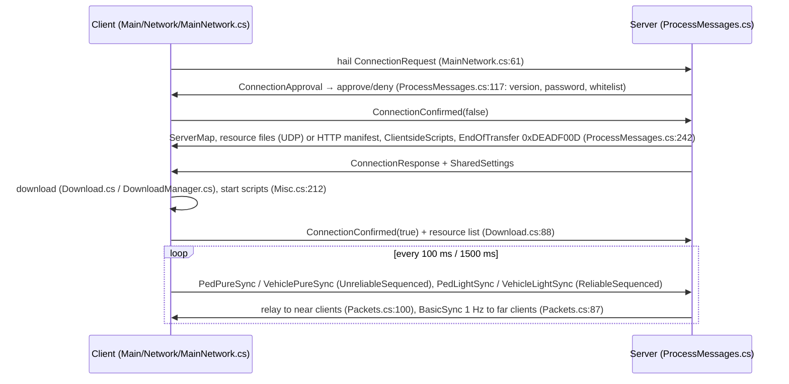

# Code map — where things live

Facts about the repository as of 4 Sept 2026 (branch `claude/agent-framework`, commit `dd263e9`). Paths are
relative to the repository root; `file:line` points at the entry point named. For "who calls this" and "what does
a change touch", use the code graph (`AGENTS.md` §6); this document is the orientation, the graph is the detail.
When a project, directory or entry point moves, change this file in the same commit.

## 1. Processes and how they talk

```mermaid
flowchart LR
  subgraph player["Player's machine"]
    L[GTANetwork.Launcher<br/>Launcher/ · .NET 10] -->|deploys ScriptHookV + SHVDN.asi, starts| P[Proton / Steam]
    P --> G[GTA5.exe]
    G -->|dinput8.dll ASI loader| S[ScriptHookVDotNet.asi<br/>Shv.NET/ · C++/CLI]
    S -->|hosts .NET Framework 4.8,<br/>second AppDomain| C[GTANetwork.dll<br/>Client/ · net48]
    C -->|stdin/stdout JSON<br/>Shared/Cef/CefHostProtocol.cs| H[cef/GTANetwork.CefHost.exe<br/>Subprocess/GTANetwork.CefHost · net48]
    H -->|shared memory CefFrameBuffer<br/>or D3D11 shared textures| C
    H --> R[CefSharp.BrowserSubprocess.exe<br/>renderer, storage]
    C -->|SharpDX + EasyHook<br/>Present hook| G
  end
  C <-->|Lidgren UDP "GTANETWORK"<br/>Shared/Packets.cs| SRV[GTANetworkServer<br/>Server/ · .NET 10]
  C -->|HTTP GET /manifest.json, /res/file<br/>Shared/ResourceFiles.cs| SRV
  B[GTANetwork.Bot<br/>Tools/GTANetwork.Bot · .NET 10] <-->|same protocol| SRV
  SRV -.->|POST /addserver (announce, off)| M[(master list<br/>none today)]
  C -.->|GET /servers, /verified, /stats| M
```

## 2. Projects

| Path | Target | Output | What it is |
| --- | --- | --- | --- |
| `Shared/GTANetworkShared.csproj` | net48; netstandard2.0 | library | Packets, sync packet codecs, entity properties, settings, resource download, CEF wire protocol, math. Used by every other project. |
| `Server/GTANetworkServer.csproj` | net10.0 | exe | Dedicated server: Lidgren UDP, streamer, resources compiled with Roslyn, scripting API, HTTP file server. |
| `Client/GTANetworkClient.csproj` | net48 x64 | `GTANetwork.dll` | In-game client: sync, streaming, JS engine (ClearScript), browser client, DirectX overlay. No CefSharp reference. |
| `NativeUI/NativeUI.csproj` | net48 x64 | library | Rockstar-style menus (GPL-3.0) used by the client's menus. |
| `Launcher/GTANetwork.Launcher.csproj` | net10.0 | exe | Cross-platform CLI launcher: deploy/restore, Steam/Proton detection, game patching, debug mode, hitch monitor. |
| `Subprocess/GTANetwork.CefHost/GTANetwork.CefHost.csproj` | net48 x64 | WinExe | The browser process (CefSharp.OffScreen 151). Its output folder ships as `cef/`. |
| `Tools/GTANetwork.Bot/GTANetwork.Bot.csproj` | net10.0 | exe | Headless client over the real protocol (CI integration tests, load tests). |
| `Tools/CefHarness/CefHarness.csproj` | net48 x64 | exe | Browser acceptance test without the game (drives the host; in-process modes reproduce the AppDomain failure). |
| `Map2Resource/Map2Resource.csproj` | net10.0 | exe | Map Editor XML → server map resource. |
| `Shv.NET/ScriptHookVDotNet.vcxproj` | C++/CLI, v4.8 | `ScriptHookVDotNet.dll/.asi` | The hook (MSVC + ScriptHookV SDK; CI Windows job). `Shv.NET/sdk-compat/` builds a stub `ScriptHookV.lib` when the SDK is not downloadable. |
| `Shv.NET/ref/ScriptHookVDotNet.Ref.csproj` | net48 | stub `ScriptHookVDotNet.dll` | Compile-only reference stub (every native throws). Never shipped; not binary compatible. |
| `Subprocess/GTANSubprocess`, `Subprocess/PlayGTANetwork`, `Subprocess/PlayGTANetworkUpdater` | net48 | `launcher/GTANetwork.dll`, `GTANSubprocess.exe`, `GTANLauncher.exe` | The classic three-stage Windows launcher (registry, self-update from the old master, DLL injection). Still built and packaged into `launcher/`; superseded by `Launcher/` (see `docs/DECISIONS.md` Q-13). |

Build settings: `Directory.Build.props` (version scheme `0.1.<days since 2016-01-01>.<UTC minutes/2>`, package
versions, `UseRealShvdn` when `Shv.NET/bin/ScriptHookVDotNet.dll` exists), `global.json` (SDK 8.0.100, roll forward).

## 3. Shared (`Shared/`)

| File | Content |
| --- | --- |
| `Packets.cs` | `PacketType` (1–40), `ConnectionChannel` (0–11), `FileType`, `SyncEventType`, `ServerEventType`, flags; protobuf contracts `ConnectionRequest`/`ConnectionResponse`, `SharedSettings`, `ServerMap`, `ScriptCollection`, `ClientsideScript`, `CreateEntity`/`UpdateEntity`/`DeleteEntity`, `SyncEvent`, `DiscoveryResponse`, `PlayerDisconnect`. |
| `SyncPackets.cs` | `PedData`, `VehicleData` (nullable fields → delta packets). |
| `PacketOptimization.cs` | Hand-rolled little-endian codecs for pure/light/basic/bullet/unoccupied sync (writers first, readers from ~line 386). |
| `EntityProperties.cs` | `EntityType`, `EntityFlag`, `EntityProperties` and per-type subclasses with `Delta_*` mirrors, `VehicleDamageModel`, `Attachment`, `Movement`. |
| `ServerSettings.cs` | Server `settings.xml` schema (`Port`, `MaxPlayers`, `Announce`, `UseHTTPServer`, streaming ranges, `RefreshHz`, whitelist, resources list). No master address field (hardcoded in the server). |
| `PlayerSettings.cs` | Client/launcher `settings.xml` (`MasterServerAddress` default empty, `Cef*` settings, launcher settings, `DebugMode`). |
| `ResourceFiles.cs` | `ResourceFileDownloader`: HTTP `GET /manifest.json`, `GET /<resource>/<path>`, MD5 skip, `TryGetLocalPath` traversal guard. Used by the client, the bot and the browser host. |
| `GTANSchemeListener.cs` | `gtan://` auto-join through a named memory-mapped file; `FileManifest`, `FileDeclaration`. |
| `MasterServerAnnounce.cs` | The JSON body of `POST <master>/addserver`. |
| `VersionCompatibility.cs` | `LastCompatibleClientVersion` / `LastCompatibleServerVersion` (0.1.386.x). |
| `NativeData.cs` | Server→client native calls: `NativeData`, `NativeArgument` hierarchy, `NativeResponse`, `NativeTickCall`, `ScriptEventTrigger`. |
| `Cef/CefHostProtocol.cs` | Game ⇄ browser host protocol (version 2): commands, events, `CefHostMessage`, `CefHostChannel` (length-prefixed JSON), `FrameBufferName`. |
| `Cef/CefFrameBuffer.cs` | Shared-memory BGRA frame with a 64-byte header and a seqlock; `Create` (host) / `Open` (game). |
| `CefLaunch.cs` | Chromium switch list shared by the host and the harness. |
| `Math/Vector3.cs`, `Quaternion.cs`, `Matrix4.cs`; `NetHandle.cs`, `BitReader.cs`, `Keys.cs`, `*Hashes.cs`, `Util.cs` | Math independent of SHVDN, handles, hash enums, helpers (`ParseableVersion`, `ImpatientWebClient`, `MimeType`). |

## 4. Server (`Server/`)

Entry: `Server/Program.cs:128` `Main` — signal handlers (`:216`), `ServerSettings.ReadSettings`, `GameServer.Start`.
Main loop: `Server/Program.cs:179` `while (!CloseProgram) { ServerInstance.Tick(); Thread.Sleep(1000/60); }`.
Tick: `Server/GameServer.cs:559` — UDP file transfer pump, `ProcessMessages()`, `NetEntityHandler.UpdateMovements()`,
pickups, unoccupied vehicles, per-resource `InvokeUpdate()`, master re-announce (2 min), connection queue, AFK kicks.
Second thread: `Server/Managers/Streamer.cs:18` `MainThread` (every 100 ms; recomputes near/far sets at 1 Hz;
`NearRange = 2500 m`, `MaxNear = 250`).

| File | Content |
| --- | --- |
| `GameServer.cs` (1315 lines) | The server object: Lidgren `NetServer` (`"GTANETWORK"`), `Start` (:204), `AnnounceSelfToMaster` (:263; `MasterServer = "http://master.gtanet.work"` hardcoded at :115), `LoadMap` (:333), `Tick` (:559), `HandleDisconnect` (:712), `HandleSyncEvent` (:765), entity property get/set, interpolation. |
| `ProcessMessages.cs` (1421) | Inbound: `ProcessMessages()` :26; `DiscoveryRequest` :56, `ConnectionApproval` :117, `StatusChanged` :220, `PacketType` switch :240 — `ConnectionConfirmed` :242 (map + files + client scripts + `0xDEADF00D` end marker), `ChatData` :398, `VehiclePureSync` :491, `VehicleLightSync` :695, `PedPureSync` :832, `PedLightSync` :935, `BulletSync` :974, `UnoccupiedVehSync` :1024, `SyncEvent` :1183, `ScriptEventTrigger` :1196, `NativeResponse` :1222, `FileAcceptDeny` :1267, `PlayerKilled` :1287, `PlayerRespawned` :1305, `UpdateEntityProperties` :1323. |
| `Packets.cs` (597) | Outbound: `CollectNear`/`CollectFar` :51/:65, `SendBasicSync` :87, `ResendPacket` :100/:123 (relay to near clients), `ResendUnoccupiedPacket` :180, `ResendBulletPacket` :234, `SendToClient`/`SendToAll` :282–:303, entity/native/blip/team/spectate/animation events :314–:586. |
| `API.cs` (4212; 381 public members) | The scripting API: `abstract class Script { API API }` (:36), `class API` (:41), ~33 `public event` hooks (:88–:122), functions from :326 (`triggerClientEvent` :2622, `sendChatMessageToPlayer` :2649, `exported` :644). |
| `Resources.cs` (524) | `StartResource` :26 (meta.xml, includes, ACL, file hashing into `FileModule.ExportedFiles`, C#/VB/JS split), `StopResource` :425, `GetAllClientsideScripts` :480. |
| `ResourceInfo.cs` (864) | `ScriptingEngine` (:22; compiled assembly + `Invoke*` dispatchers :213–:645), `Resource`, and the meta.xml schema from :688. |
| `Managers/ScriptCompiler.cs` | Roslyn in-memory compilation of C#/VB resources, `Assembly.Load(bytes)`. |
| `Runtime/RuntimeBridge.cs`, `RuntimeProcess.cs`, `ApiDispatcher.cs`, `StateMirror.cs`, `BridgeCodec.cs` | The bridge to the Bun runtime for TypeScript server resources (D-09): process supervision, Unix-socket/TCP connection with a token handshake, `call` → `API` member by reflection with argument conversion, `event` frames from `ScriptingEngine` (typescript mode), 10 Hz player-state deltas, frame codec. |
| `Managers/Streamer.cs` | Near/far recipient sets per client. |
| `Managers/NetEntityHandler.cs` | Server entity registry, handles, `UpdateMovements`, `CreateWorld`. |
| `Managers/FileServer.cs` | `HttpListener` on the game port (TCP): `GET /manifest.json`, `GET /<resource>/<path>` for declared `<file>`s; traversal guard. |
| `Managers/CommandHandler.cs` | `[Command]` attribute + reflection dispatch. |
| `Managers/DeltaCompressor.cs`, `AccessControlList.cs`, `Bans.cs`, `ColShape.cs`, `PickupManager.cs`, `UnoccupiedVehicleManager.cs`, `StressTest.cs` | Delta reconstruction, ACL (`acl.xml`), bans, colshapes, pickups, unoccupied vehicles, a disabled synthetic load helper. |
| `Elements/Client.cs` (680) and `Entity.cs`, `Vehicle.cs`, `Blip.cs`, `Marker.cs`, `Object.cs`, `ParticleEffect.cs`, `Ped.cs`, `Pickup.cs`, `TextLabel.cs` | Script-facing wrappers; `Client` holds per-player state (streamer sets, delta compressor, last packet, weapons, position, health). |
| `Constant/*.cs` | `NativeHashes.cs` (3410), `PedHashes.cs`, `WeaponComponentHash.cs`, `ExplosionTypes.cs`, `ConstantVehicleData.cs` (reads `vehicleData.json`), `Color.cs`, `LogCat.cs`, `ChatData.cs`. |
| `XmlParser.cs`, `MemberwiseClone.cs`, `settings.xml`, `resources/{example,freeroam,auth}` | Map XML wrapper, deep copy, shipped config (`announce=false`, `httpserver=true`), shipped resources (§8). |

## 5. Client (`Client/`)

No `Main()`: every `GTA.Script` subclass is instantiated by ScriptHookVDotNet and gets `Tick`/`KeyDown`.
Primary entry: `Client/Main.cs:266` `Main()` — settings, `JavascriptHook.ConfigureClearScript()`, streamer, camera,
sync watchers, chat, `Tick += OnTick` (:335), `KeyDown += OnKeyDown` (:337), Lidgren `NetPeerConfiguration("GTANETWORK")`, menu, server browser.

Per-frame loops (each a `Script`): `Client/Main.cs:31` `MessagePump` (drains network messages → `ProcessMessages`);
`Client/Main.cs:471` `Main.OnTick`; `Client/Sync/Threads.cs:16` `SyncThread` (`SyncPed.Render` for every streamed
player) and `:39` `NametagThread`; `Client/Sync/SyncSender/SyncSender.cs:169` `SyncCollector` (`OnTick` :182 builds the
local `PedData`/`VehicleData`; a background thread `MainLoop` :15 sends pure sync every 100 ms, light sync every 1500 ms);
`Client/Streamer/StreamerThread.cs:22` (stream-in/out on the game thread; calculations every 500 ms on a worker);
`Client/GUI/DirectXHook/SwapchainHooker.cs:8` (Present hook → overlay); `Client/GUI/CEFManager.cs:63` `CefController`
(mouse/keyboard to browsers); `Client/Javascript/JavascriptHook.cs:133` (script events and the `ThreadJumper` queue);
`Client/Main/Events.cs:37`, `Client/Main/Cleanup.cs`, `Client/Streamer/Main.cs` draw/update scripts, `Client/GUI/ClassicChat.cs` `ChatThread`.

| Directory / file | Content |
| --- | --- |
| `Main.cs` (690) | Global state, construction, tick, keys, `GTANInstallDir` (:173). |
| `Main/Network/MainNetwork.cs` (401) | `ConnectToServer` :61 (hail `ConnectionRequest`), `OnLocalDisconnect` :168, `SendToServer` :261, `TriggerServerEvent` :271. |
| `Main/Network/ProcessMessages.cs` (1070) | `ProcessMessages` :799; `PacketType` switch from :31 (`CreateEntity` :143, `UpdateEntityProperties` :210, `DeleteEntity` :252, file transfer :275–:312, `ServerEvent` :328, `SyncEvent` :555, `ScriptEventTrigger` :763, `NativeCall` :778); `StatusChanged` :816 (connect flow, starts the browser host on `InitiatedConnect`), `DiscoveryResponse` :941. |
| `Main/Network/Packets.cs`, `Download.cs` | Apply decoded sync onto `SyncPed`; HTTP resource download thread (`InvokeFinishedDownload` :88 → `ConnectionConfirmed(true)`). |
| `Main/Menu.cs` (1328) | Main menu and server browser (NativeUI): master calls `/welcome.json` :94, `/servers`, `/verified`, `/stats` :272–:292, favourites/recent, LAN discovery :232, settings items. |
| `Main/Misc.cs` (703) | `AddMap` :48, `StartClientsideScripts` :212, `SaveSettings` :358, `VerifyDLC` :363 and `IntegrityCheck` :409 (compiled out: `#if INTEGRITYCHECK`), loading prompts. |
| `Main/Natives.cs`, `Events.cs`, `Properties.cs`, `Spectate.cs`, `Cleanup.cs` | Server-requested native calls, local event detection, entity properties, spectator, world cleanup. |
| `Networking/DownloadManager.cs` (385), `Networking/DeltaCompressor.cs` | UDP file transfer with MIME allow-list, `<install>\resources\` (:330), pending script collection; client delta reconstruction. Every other `Networking/*.cs` file is legacy and excluded from the build (`GTANetworkClient.csproj` `Compile Remove`). |
| `Streamer/Main.cs` (2411), `StreamerThread.cs`, `StreamedItems.cs`, `WeaponManager.cs` | Client entity registry (`Streamer`), stream in/out per type (`StreamIn` :1573, `StreamInVehicle` :1764), attachments :1381, interpolations :1477, markers/labels :2357/:2379; budgets (`MAX_PLAYERS 250`, `MAX_VEHICLES 60`, `MAX_OBJECTS 500`) and ranges (2000/1000/500 m). |
| `Sync/SyncPed.cs` (491), `Sync/Entity/OnFoot.cs` (1034), `Entity/Vehicle.cs` (513), `Entity/UnoccupiedVehicle.cs`, `Sync/Interpolation.cs`, `Sync/Misc.cs`, `Sync/Nametag.cs`, `Sync/SyncEventWatcher.cs`, `Sync/SyncSender/*` | Remote player representation and rendering (coords forcing, tasks, interpolation, ragdoll/parachute/cover), sync event detection (doors, lights, trailers, tyres), local data collection. Review and open findings: `docs/SYNC.md`. |
| `Javascript/JavascriptHook.cs` (4632; `ScriptContext` 403 public members) | Client scripting: `ConfigureClearScript` :348, `StartScripts` :366, `StartScript` :408 (one `V8ScriptEngine` per script file, host object `API` = `ScriptContext` :586, `resource`, `exported`; `AllowReflection=false`), CEF API :1102–:1325, `triggerServerEvent` :3839, events from :3878. `CameraManager.cs`, `JavascriptChat.cs`, `JavascriptXmlParser.cs`, `Attach.cs`, `LoopAudioStream.cs` support it. |
| `GUI/CEFManager.cs` (1277) | Browser host client: `CefController` :63, `CEFManager` :273 (`InitializeCef` :326, `StartHost` :347, `ReadEvents` :410, `Dispatch` :455, `Send` :573, idle exit :617–:648, frame pump :731, `DisposeCef` :765), `BrowserJavascriptCallback` :842, `Browser` :948, `BrowserInput` :1232. |
| `GUI/CefClient.cs` (348) | `OverlayRenderHandler` (shared-memory frames or shared textures → overlay), `CefFrameStager`. |
| `GUI/ConnectLoader.cs` | The connect loading screen: a client-owned full-screen browser showing `ui/loader/index.html` (`https://gtan/…`) from `InitiatedConnect` until the resources are downloaded. |
| `GUI/DirectXHook/**` | EasyHook + SharpDX D3D11 overlay: `SwapchainHooker.cs`, `Hook/DXHookD3D11.cs` (Present hook, `[PROFILE]`/`[HITCH]`), `Hook/DX11/DXOverlayEngine.cs` (draw, shared-texture copy), `DXImage.cs`, `Hook/Common/*` (elements, `SharedTextureSurface.cs`, `IDynamicSurface.cs`). D3D10 hooks are excluded from the build. |
| `GUI/Chat.cs`, `ClassicChat.cs`, `Warning.cs`, `Tab*.cs`, `Extern/*` | Chat, warnings, pause-menu tabs, image helpers. |
| `Misc/GameSettings.cs`, `GameScript.cs`, `WeaponDataProvider.cs`, `ChatData.cs` | GTA V settings patching, SP script disabling, weapon metadata, chat contract. |
| `Util/*` | `LogManager.cs` (Runtime/CEF/Error logs, `Verbose`), `NativeWhitelist.cs` (4281 hashes from the embedded `natives.txt`), `MimeSniffer.cs`, `MemoryScan.cs`, `EntityMemoryHandler.cs` (root), `DebugInfo.cs`, `Util.cs`, others. |

## 6. Browser host and harness

| File | Content |
| --- | --- |
| `Subprocess/GTANetwork.CefHost/Program.cs` (~900) | Options (`--parent`, `--log`, `--chromium-log`, `--cache`, `--resource-root`, `--ui-root` (client pages as `https://gtan/<path>`), `--gpu`, `--gpu-process`, `--media-stream`, `--verbose`, `--devtools`, `--chromium-switch`), `Cef.Initialize`, command loop, `HostedBrowser` (:366), `FrameWriter` (`OnPaint` → `CefFrameBuffer`; `OnAcceleratedPaint` → `TextureRelay`), local `https://<resource>/` serving (`LocalResourceRequestHandler`), the bridge shim (`resourceCall`, `resourceEval`, `gtan`) injected into served HTML, pop-up/menu handlers, parent watchdog. |
| `Subprocess/GTANetwork.CefHost/TextureRelay.cs` | The per-browser ring of 4 D3D11 shared textures on the host's own device, GPU-completion wait, `textures`/`texture` events. |
| `Tools/CefHarness/Program.cs`, `HostTest.cs`, `SharedTextureReader.cs` | The acceptance test (`eng/cef-harness.sh`): protocol run, pixels, bridge, eval→frame latency, shared-texture read-back, benchmarks; in-process modes for the AppDomain diagnosis. |

Design, measurements and the history: `docs/CEF-UPGRADE.md`.

## 7. Launcher, bot, tools

| File | Content |
| --- | --- |
| `Launcher/Program.cs` | Commands (play/restore/doctor/…), `--debug`, launch methods `steam`/`proton`/`direct`, waits for `GTA5.exe`, restores the game folder. |
| `Launcher/Deployment.cs`, `GamePatcher.cs`, `Steam.cs`, `Vdf.cs`, `Paths.cs`, `GameProcess.cs`, `Log.cs`, `HitchMonitor.cs` | Deploy/restore of mod files, GTA V settings patching, Steam library/Proton/prefix detection, install paths, process lookup by `/proc`, logging, the `--debug` system monitor. |
| `Tools/GTANetwork.Bot/Program.cs` | Options (`--host`, `--port`, `--name`, `--password`, `--say`, `--expect`, `--duration`, `--no-sync`, `--discover`, `--download-files`, `-i`), one Lidgren connection, the protocol handshake and sync loop, chat assertions. Also compiles `Shv.NET/ref/Core/NativeHashes.g.cs`. |
| `Map2Resource/` | Map Editor XML → resource. |
| `runtime/main.ts`, `bridge.ts`, `msgpack.ts`, `state.ts`, `resources.ts`, `gtan/index.ts`, `gtan/api.generated.d.ts` | The Bun runtime: connects to the engine, loads each TypeScript resource's `default function main(gtan)`, dispatches events and commands, mirrors player state, hot-reloads on file changes; `gtan.api` is typed from the generated declarations. Shipped as `runtime/` next to the server. |
| `Tools/GTANetwork.BridgeBench/Program.cs`, `runtime/bench/bench.ts`, `eng/bench-bridge.sh` | The engine ⇄ Bun bridge benchmark (T-006 stage 1): frame protocol `u32 length + msgpack [type, id, name, payload]`, one-way/round-trip/state-mirror measurements over a Unix socket and loopback TCP. `runtime/.bun-version` pins Bun. |

## 8. Network protocol (server ⇄ client)

Transport: Lidgren.Network fork (`libs/Lidgren.Network.dll`, adds `MaxPlayers`), UDP, app id `GTANETWORK`. Every
data message starts with `(byte)PacketType`; protobuf payloads are `int length + bytes`; sync packets use the codecs
in `Shared/PacketOptimization.cs`. Channels: `ConnectionChannel` (Default, FileTransfer, NativeCall, Chat, EntityBackend,
ClientEvent, SyncEvent, PureSync, LightSync, BasicSync, BulletSync, UnoccupiedVeh, Rpc).

**RPC** (T-008): `PacketType.RpcRequest`/`RpcResponse` carry `Shared/Rpc/RpcMessages.cs` (`RpcRequest {Id, Name, Resource,
Payload = one JSON value, TimeoutMs, Origin}`, `RpcResponse {Id, Ok, Payload, ErrorCode, ErrorMessage}`) on the reliable ordered
channel `Rpc`; codes and limits in `Shared/Rpc/RpcCodes.cs` (64 KB per payload, 10 s default / 60 s maximum timeout, 30
requests per second per player). Server side `Server/Managers/RpcDispatcher.cs` (registry, size/rate/allow checks, C# handlers on
the resource's script thread, TypeScript handlers through the bridge's `EventWithResult`, `callClient` with a per-tick timeout
scan); client side `Client/Javascript/RpcContext.cs` (`API.rpc`; promises and the handler table live in a JavaScript helper in the
script's engine, `RpcRouter` moves the packets and expires calls on the script tick).



Sync classes: send side `Client/Sync/SyncSender/*`; server `Server/ProcessMessages.cs` (:491/:695/:832/:935) +
`Server/Managers/DeltaCompressor.cs` + `Server/Packets.cs`; receive side `Client/Main/Network/ProcessMessages.cs`
(:36–:142) → `Packets.cs` → `SyncPed`, rendered by `Client/Sync/Threads.cs`. Entities: `CreateEntity`/`UpdateEntityProperties`/`DeleteEntity`
with `EntityProperties`; registries `Server/Managers/NetEntityHandler.cs` and `Client/Streamer/Main.cs`. LAN discovery:
`DiscoveryRequest`/`DiscoveryResponse` (`Server/ProcessMessages.cs:56`, `Client/Main/Menu.cs:232`). Details and open
issues: `docs/SYNC.md`.

## 9. Scripting

**Server resources** — `resources/<name>/meta.xml` listed in `settings.xml`; started by `Server/Resources.cs:26`.
Languages: C#/VB compiled at start by `Server/Managers/ScriptCompiler.cs` (Roslyn), `compiled` assemblies, `javascript`
(client only). API: `GTANetworkServer.Script` + `API` (`Server/API.cs`); events via `ScriptingEngine.Invoke*`
(`Server/ResourceInfo.cs:213–:645`); commands via `[Command]`; cross-resource `<export>` → `API.exported`;
client events `API.triggerClientEvent` (`Server/API.cs:2622`) ⇄ `PacketType.ScriptEventTrigger` (`Server/ProcessMessages.cs:1196`);
request/response calls `API.registerRpc(name, handler, allow?)` / `API.callClient(player, name, args)` (§8 RPC). TypeScript
resources (Bun runtime, `runtime/gtan/index.ts`): `gtan.rpc.register(name, handler, { allow })`, `gtan.rpc.callClient`.

**Client scripts** — `ClientsideScript` records delivered during download, started by `Client/Main/Misc.cs:212` →
`JavascriptHook.StartScripts` (`Client/Javascript/JavascriptHook.cs:366`): one `V8ScriptEngine` per file, host object
`API` (`ScriptContext` :586), `resource`, `exported`; events use `.connect(handler)`; dispatch on the game thread through
`ThreadJumper`. Debug mode opens the V8 inspector on 9222. `API.rpc.call(name, args)` → Promise of the server handler's answer,
`API.rpc.register(name, handler)` for calls from the server and from the resource's pages (`Client/Javascript/RpcContext.cs`).

**CEF pages** — the host injects `resourceCall(name, ...args)`, `resourceEval(code)`, `gtan.call/eval` into every served
page (`Subprocess/GTANetwork.CefHost/Program.cs`, `ResourceBridgeInjector`); page → host `jsMessage` → game
(`Client/GUI/CEFManager.cs:1112`) → `BrowserJavascriptCallback` (function name validated) in the owning resource's engine;
game → page `Browser.eval/call` (:1137/:1143). `gtan.rpc.call(name, args)` → host message `rpc` → `BrowserJavascriptCallback.Rpc`
→ the owning script's `API.rpc` (its own handler or the server's) → `gtan.rpc._settle(id, …)` evaluated in the page.

**meta.xml** (schema `Server/ResourceInfo.cs:688+`): `<info name author version type={script|gamemode|map} …/>`,
`<script src type={server|client} lang={javascript|csharp|vbasic|compiled}/>`, `<file src/>`, `<assembly ref/>`,
`<include resource/>`, `<map src dimension/>`, `<export class function event/>`, `<acl src/>`, `<settings>`, `<config src type/>`.
Shipped resources: `Server/resources/example` (C# `/hello`), `freeroam` (C# gamemode + `client.js`; RPC `freeroam:ping`,
`freeroam:secret`), `auth` (accounts, PBKDF2, CEF login page `ui/index.html` + `ui/app.js` calling `auth:login` / `auth:register`
over `gtan.rpc.call`), `tsdemo` (TypeScript on the Bun runtime; RPC `tsdemo:echo`).

## 10. Master list, voice, anti-cheat, DLC — what exists

* **Master list**: server announce `POST <master>/addserver` (`Server/GameServer.cs:263`, address hardcoded at :115,
  `announce=false` shipped); client `GET /welcome.json`, `/servers`, `/verified`, `/stats` in `Client/Main/Menu.cs`
  when `PlayerSettings.MasterServerAddress` is set (empty by default). The classic launcher's updater endpoints
  (`Subprocess/GTANSubprocess/EntryPoint.cs`, `PlayGTANetworkUpdater/Program.cs`) point at the dead master.
* **Voice**: none (only the CEF `getUserMedia` switch, `Shared/CefLaunch.cs` `mediaStream`).
* **Anti-cheat**: native allow-list (`Client/Util/NativeWhitelist.cs`), download MIME allow-list and sniffing, path
  traversal guards, server ACL/bans/whitelist/minimum version; the client integrity check is compiled out
  (`Client/Main/Misc.cs:409`, `#if INTEGRITYCHECK`).
* **DLC/RPF**: none; `_ENABLE_MP_DLC_MAPS`/`_LOAD_MP_DLC_MAPS` at `Client/Main.cs:354`, `EnableMpVehiclesGlobal` setting.

## 11. Build, CI, scripts, tests

`.github/workflows/build.yml`: jobs `linux` (build, publish, smoke test, bot integration tests, artifacts), `windows`
(SHVDN C++/CLI, client package with page-aligned `cef\`, NSIS installer), `release` (dispatch with `release_tag` or a
`v*` tag; notes from `CHANGELOG.md`). `eng/`: `version.sh`, `smoke-test-server.sh`, `integration-test.sh`,
`integration-test-auth.sh`, `dev-test.sh`, `dev-build-client.sh`, `dev-sync-client.sh`, `package-client.ps1`,
`pe-realign.py`, `cef-harness.sh`, `setup-linux.sh`. Tests: no unit-test project; the shell-driven tests above and the
CEF harness (`docs/agents/testing.md`). Dev container: `.devcontainer/`, `docker-compose.yml` (`docs/DEVCONTAINER.md`).

## 12. Data, vendored and dead files

* `libs/`: used — `Lidgren.Network.dll`, `NAudio.dll`, `SharpDX*.dll`; copied at packaging — `EasyHook64.dll`,
  `EasyLoad64.dll`, `sharpdx_direct3d11*_x64.dll`; **unused leftovers** — `EasyHook.dll`, `Interop.WMPLib.dll`,
  `Ionic.Zip.dll`, `Microsoft.Owin*.dll`, `Nancy*.dll`, `NAudio.WindowsMediaFormat.dll`, `Newtonsoft.Json.dll`, `Owin.dll`,
  `protobuf-net.dll` (NuGet versions are used).
* `ui/loader/` — the connect loading screen (HTML/CSS/JS), shipped as `<install>/ui`.
* `natives.txt` (root) = `Client/natives.txt` (embedded, 4281 hashes); `Client/soundlist.txt`; `vehicleData.json`
  (read by `Server/Constant/ConstantVehicleData.cs`); `whitelist.txt` (1-byte placeholder); `images/**` (HUD, blips,
  radio art, `cef/cursor.png`).
* Generated: `Shv.NET/ref/Core/NativeHashes.g.cs` (from `Shv.NET/ref/generate-hashes.py`), `Server/Constant/NativeHashes.cs`.
* Excluded from the client build (legacy): `Client/Chat.cs`, `ClassicChat.cs` (root copies), `Client/Networking/{PedThread,StreamedItems,Streamer,SyncEventWatcher,SyncPed,SyncSender,UnoccupiedVehicleSync,WeaponManager}.cs`,
  `Client/Main/Math.cs`, `Client/Misc/Program.cs`, `Client/Util/DebugWindow.cs`, D3D10 hooks.
